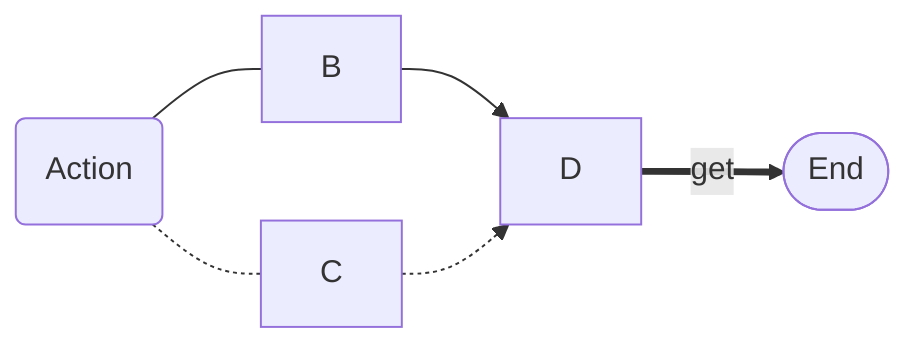
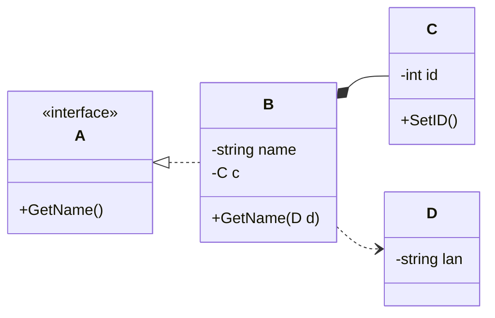
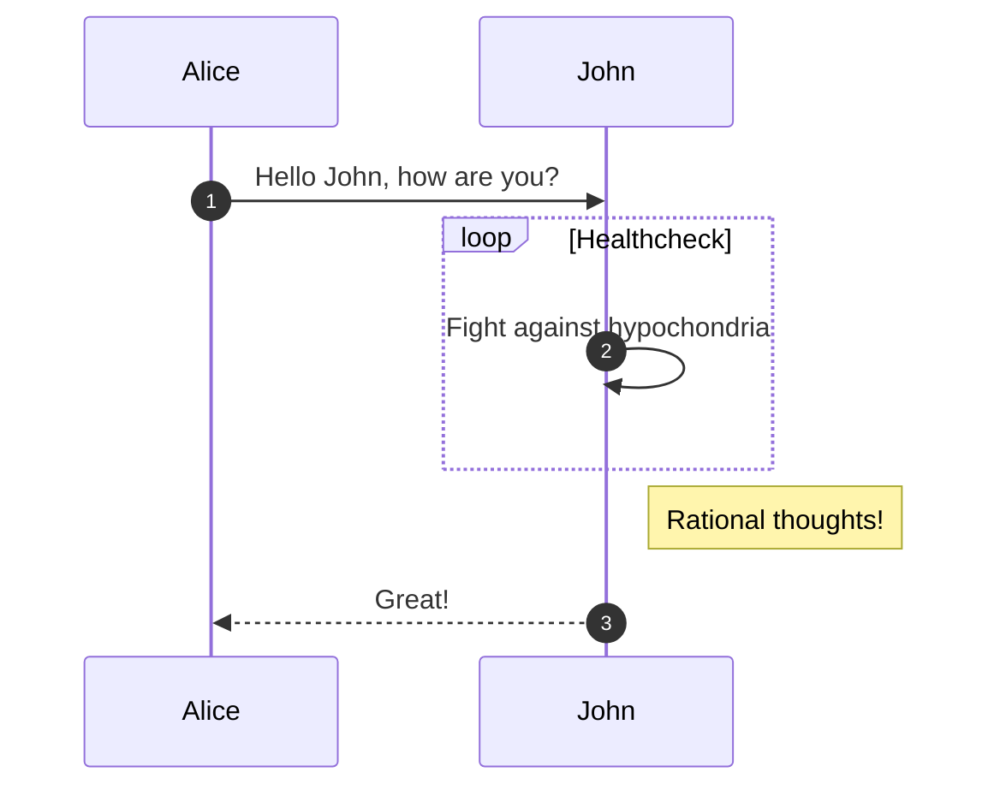
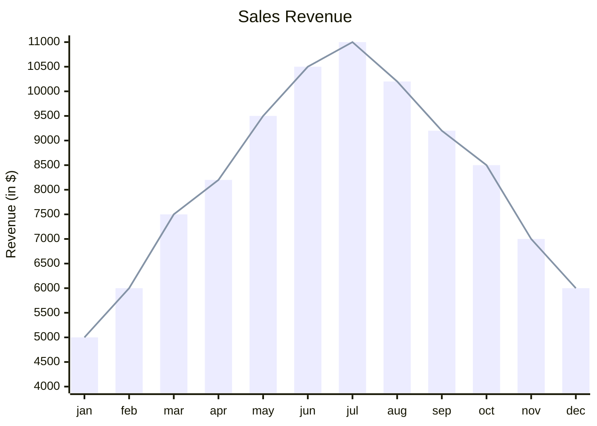
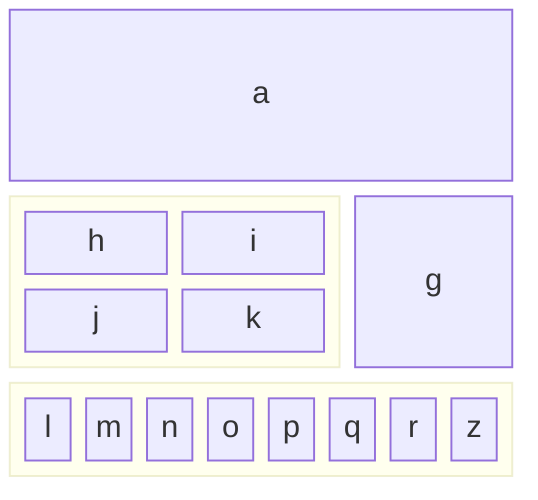

## Badge
> Made by [shields.io](https://shields.io/badges/static-badge)


## Equations

> Latex support required.

Inline mode: 

$a^2 + b^2 = c^2$

```markdown
$a^2 + b^2 = c^2$
```

Block mode:

$$\frac{x}{1+x} \le ln(1+x) \le x$$

$$\frac{x_1 + \cdots + x_n}{n} \ge \sqrt[n]{x_1 \cdots x_n} \ge \frac{n}{\frac{1}{x_1} + \cdots + \frac{1}{x_n}}$$

```markdown
$$\frac{x}{1+x} \le ln(1+x) \le x$$

$$\frac{x_1 + \cdots + x_n}{n} \ge \sqrt[n]{x_1 \cdots x_n} \ge \frac{n}{\frac{1}{x_1} + \cdots + \frac{1}{x_n}}$$
```

## Diagrams

### ASCIIFlow

> Drawn with [ASCIIFlow](https://asciiflow.com/) 

```
┌──────┐            ┌──────┐
│      │            │      │
│  TL  ├───────────►│  TR  │
│      │            │      │
└──────┘            └───┬──┘
   ▲                    │
   │                    ▼
┌──┴───┐            ┌──────┐
│      │            │      │
│  BL  │◄───────────┤  BR  │
│      │            │      │
└──────┘            └──────┘
```

### Mermaid

> Draw with [Mermaid](https://mermaid.js.org/syntax/flowchart.html)

#### Flowchart



```
flowchart LR
    A(Action) --- B
    A -.- C
    B --> D
    C -.-> D
    D == get ==> E([End])
```

#### Class Diagram



```
classDiagram
    direction TD
    class A {
        <<interface>>
        +GetName()
    }
    class B {
        -string name
        -C c
        +GetName(D d)
    }
    class C {
        -int id
        +SetID()
    }
    class D {
        -string lan
    }
    A <|.. B
    B *-- C
    B ..> D
```

### Sequence Diagram



```
sequenceDiagram
    autonumber
    Alice->>John: Hello John, how are you?
    loop Healthcheck
        John->>John: Fight against hypochondria
    end
    Note right of John: Rational thoughts!
    John-->>Alice: Great!
```

### XYChart



### Block Diagram



```
block-beta
  columns 3
  %% blocks that span multiple columns
  a:3
  block:group1:2
    columns 2
    h i j k
  end
  g:1
  block:group2:3
    %% columns auto (default)
    l m n o p q r z
  end
```

## Special Symbols

| symbol    | code       | symbol   | code       | symbol    | code       | symbol   | code       |
|-----------|------------|----------|------------|-----------|------------|----------|------------|
|  &amp;    | `&amp;`    | &darr;   | `&darr;`   |  &supe;   | `&supe;`   | &cent;   | `&cent;`   |
|  &lt;     | `&lt;`     | &harr;   | `&harr;`   |  &sube;   | `&sube;`   | &pound;  | `&pound;`  |
|  &gt;     | `&gt;`     | &varr;   | `&varr;`   |  &nsub;   | `&nsub;`   | &frac12; | `&frac12;` |
|  &nbsp;   | `&nbsp;`   | &crarr;  | `&crarr;`  |  &sup;    | `&sup;`    | &frac14; | `&frac14;` |
|  &iquest; | `&iquest;` | &lArr;   | `&lArr;`   |  &sub;    | `&sub;`    | &permil; | `&permil;` |
|  &quest;  | `&quest;`  | &rArr;   | `&rArr;`   |  &cap;    | `&cap;`    | &there4; | `&there4;` |
|  &laquo;  | `&laquo;`  | &uArr;   | `&uArr;`   |  &cup;    | `&cup;`    | &pi;     | `&pi;`     |
|  &raquo;  | `&raquo;`  | &dArr;   | `&dArr;`   |  &fnof;   | `&fnof;`   | &sup1;   | `&sup1;`   |
|  &quot;   | `&quot;`   | &hArr;   | `&hArr;`   |  &radic;  | `&radic;`  | &alpha;  | `&alpha;`  |
|  &lsquo;  | `&lsquo;`  | &vArr;   | `&vArr;`   |  &infin;  | `&infin;`  | &beta;   | `&beta;`   |
|  &rsquo;  | `&rsquo;`  | &spades; | `&spades;` |  &deg;    | `&deg;`    | &gamma;  | `&gamma;`  |
|  &ldquo;  | `&ldquo;`  | &hearts; | `&hearts;` |  &ne;     | `&ne;`     | &delta;  | `&delta;`  |
|  &rdquo;  | `&rdquo;`  | &clubs;  | `&clubs;`  |  &equiv;  | `&equiv;`  | &theta;  | `&theta;`  |
|  &para;   | `&para;`   | &diams;  | `&diams;`  |  &le;     | `&le;`     | &lambda; | `&lambda;` |
|  &sect;   | `&sect;`   | &loz;    | `&loz;`    |  &ge;     | `&ge;`     | &sigma;  | `&sigma;`  |
|  &times;  | `&times;`  | &copy;   | `&copy;`   |  &perp;   | `&perp;`   | &tau;    | `&tau;`    |
|  &divide; | `&divide;` | &reg;    | `&reg;`    |  &larr;   | `&larr;`   | &dagger; | `&dagger;` |
|  &plusmn; | `&plusmn;` | &trade;  | `&trade;`  |  &rarr;   | `&rarr;`   | &Dagger; | `&Dagger;` |
|  &otimes; | `&otimes;` | &yen;    | `&yen;`    |  &uarr;   | `&uarr;`   |          |            |
|  &oplus;  | `&oplus;`  | &euro;   | `&euro;`   |

## *Unicode Character Code

| symbol    | code        | symbol    | code        | symbol    | code        | symbol    | code        |
|-----------|-------------|-----------|-------------|-----------|-------------|-----------|-------------|
| &#10000;  | `&#10000;`  | &#10048;  | `&#10048;`  | &#10022;  | `&#10022;`  | &#10085;  | `&#10085;`  |
| &#10004;  | `&#10004;`  | &#10063;  | `&#10063;`  | &#10024;  | `&#10024;`  | &#10102;  | `&#10102;`  |
| &#10008;  | `&#10008;`  | &#10070;  | `&#10070;`  | &#10025;  | `&#10025;`  | &#10112;  | `&#10112;`  |
| &#10017;  | `&#10017;`  | &#10084;  | `&#10084;`  | &#10029;  | `&#10029;`  | &#128514; | `&#128514;` |


> *: Just a selection of interesting examples
>
> For more unicode character encoding please visit the site [Unicode Character Code Charts](https://www.unicode.org/charts/).
>
> Note that the syntax here uses decimal numbers.
